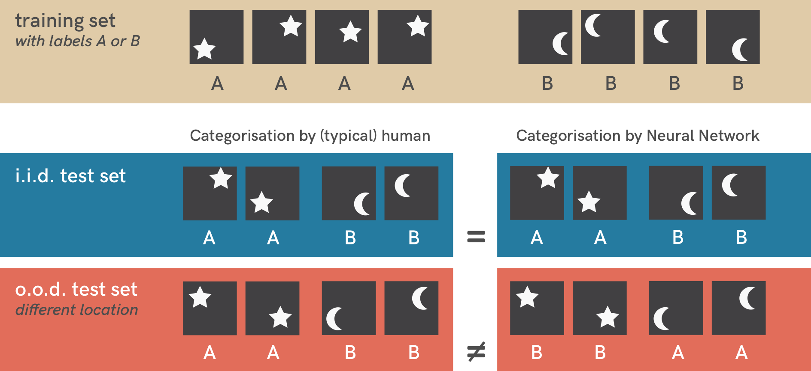

# Code & figures from "Shortcut Learning in Deep Neural Networks"

This repository contains code to reproduce the results from our toy example reported in the perspective article "Shortcut Learning in Deep Neural Networks" by Robert Geirhos, Jörn-Henrik Jacobsen, Claudio Michaelis, Richard Zemel, Wieland Brendel, Matthias Bethge & Felix A. Wichmann.

### Toy example:

When trained on a simple dataset of stars and moons (top row), a standard neural network (three layers, fully-connected) can easily categorise novel similar exemplars (middle row) but testing it on a slightly different dataset (bottom row) reveals a shortcut classification strategy: The network has learned to associate object location with a label. During training, stars were always shown in the top right or bottom left of an image; moons in the top left or bottom right, thus the neural network used location instead of shape for categorisation. This pattern is still present in samples from the i.i.d. test set (middle row) but no longer present in o.o.d. test images (bottom row). Neural networks often rely on such unintended strategies to solve problems.